<div align="center">

<h2><code>ashwin@github ~ $ whoami</code></h2>

<table>
<tr>
<td valign="top">

</td>

<td valign="top">

</td>
</tr>
</table>

</div>

<h3 align="center">
Computer Science Engineer · Cloud Computing · Full-Stack Development · AI/ML
</h3>

<p align="center">
Building practical software applications and exploring cloud technologies,
AI/ML, and modern full-stack development.
</p>

---

<div align="center">

<h2><code>ashwin@github ~ $ ./contributions.sh</code></h2>



</div>

---

## 👨‍💻 About Me

- 🎓 Final-year **B.Tech Computer Science Engineering** student specializing in **Cloud Computing** at SRMIST, Chennai
- 💻 Interested in **Full-Stack Development, Cloud Technologies, and AI/ML**
- 🚀 Experienced in building web applications using the **MERN stack**
- 🧠 Currently strengthening my **Data Structures & Algorithms** skills
- 🐍 Experienced with **Python** for software development and AI/ML projects
- 🔧 Enjoy building practical applications that solve real-world problems
- 💼 Software Engineering Intern experience
- 🎯 Currently focused on becoming a stronger software engineer

---

## 🛠️ Tech Stack

### Languages

`Python` `C++` `JavaScript` `TypeScript` `SQL`

### Frontend

`React.js` `Next.js` `HTML` `CSS` `Tailwind CSS`

### Backend

`Node.js` `Express.js` `REST APIs`

### Databases

`MongoDB` `MySQL` `PostgreSQL`

### AI / Machine Learning

`PyTorch` `Scikit-learn` `Pandas` `NumPy` `Computer Vision`

### Cloud & Tools

`AWS` `Azure` `Git` `GitHub` `Vercel`

---

## 🚀 Featured Projects

### 🧠 AI-Powered Personalized Learning System

An intelligent learning platform designed to personalize coding and technical learning through adaptive quizzes, coding practice, AI assistance, and skill tracking.

**Tech:** Next.js · React · Node.js · MongoDB · Python · AI

---

### 💬 Konnext — MERN Social Media Platform

A full-stack social media application with user authentication, REST APIs, content sharing, and database integration.

**Tech:** MongoDB · Express.js · React.js · Node.js · JWT · REST APIs

---

### 🤟 Sign Language Recognition Using CNN

A computer vision project that recognizes sign language gestures using a Convolutional Neural Network.

**Tech:** Python · PyTorch · CNN · OpenCV

---

### 🌫️ Air Quality Prediction System

A machine learning project for analyzing air-quality data and predicting air quality using data processing and machine learning techniques.

**Tech:** Python · Pandas · NumPy · Scikit-learn · Matplotlib

---

### 💧 IoT Smart Water Quality Monitoring

An IoT-based system designed to monitor water quality using sensors and provide real-time measurements.

**Tech:** Arduino · IoT · Sensors

---

### 🌱 GreenSpark

An AI-powered sustainability application designed to encourage environmentally friendly habits through digital tracking and engagement.

**Tech:** React · Next.js · Node.js · AI · Vercel

---

## 💼 Experience

### Software Engineer Intern

Worked on software development tasks involving application development, backend services, REST APIs, debugging, testing, and problem solving.

---

## 🏆 Certifications & Achievements

- 🏅 **HackerRank SQL Intermediate**
- ☁️ **Oracle Cloud Badge**
- 📊 **Deloitte Data Analytics — Forage**
- 🔐 **Cybersecurity Analyst — Forage**
- 💻 **Software Engineering Internship Experience**

---

## 🎯 Currently Learning

```text
Data Structures & Algorithms
            ↓
Full-Stack Development
            ↓
Cloud Computing
            ↓
AI / Machine Learning
            ↓
System Design
